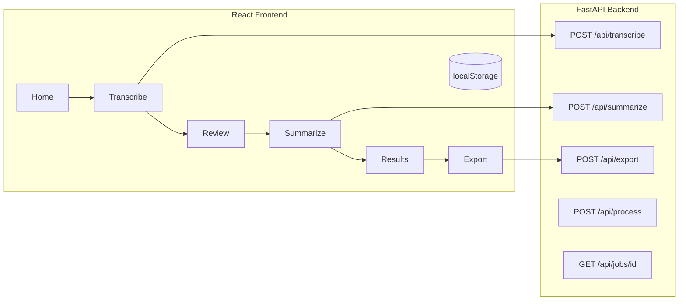

# AI-Based Meeting Summarizer

An intelligent system that converts meeting audio into structured summaries, key points, and action items.

## Team
- **Muhammad Haider Khan (B-28543)** — Speech Processing Module
- **Muhammad Mohsin (B-28583)** — NLP & Summarization Module
- **Muhammad Fahad (B-26798)** — UI & System Integration

## Features

- Upload or record meeting audio (drag-and-drop, 25 MB limit)
- Transcribe → **review & edit transcript** → summarize
- Meeting history saved in browser (localStorage)
- Action items with persistent checkboxes
- Export to TXT, DOCX, PDF (includes entities)
- Meeting templates: general, standup, client call, lecture
- Custom summarization instructions
- Transcript timeline segments (OpenAI / local Whisper)
- Light/dark theme
- Async pipeline: `POST /api/process` + `GET /api/jobs/{id}`

## Prerequisites
- **Node.js 18+**
- **Python 3.10+**
- **ffmpeg** (bundled via `static-ffmpeg` when you `pip install -r requirements.txt`)

## Installation & Setup

### 1. Backend Setup
```bash
cd backend
python -m venv venv
source venv/bin/activate  # Windows: venv\Scripts\activate
pip install -r requirements.txt
cp .env.example .env   # Windows: copy .env.example .env
# Add your OPENAI_API_KEY to .env
python -m spacy download en_core_web_sm  # only for local (non-OpenAI) mode
uvicorn main:app --reload --port 8000
```

### 2. Frontend Setup
```bash
cd frontend
npm install
cp .env.example .env   # optional: VITE_GITHUB_URL
npm run dev
```

Open http://localhost:5173

## Environment Variables

| Variable | Where | Description |
|----------|-------|-------------|
| `OPENAI_API_KEY` | backend `.env` | OpenAI API key |
| `USE_OPENAI` | backend `.env` | `true` (default) or `false` for local models |
| `OPENAI_TRANSCRIBE_MODEL` | backend `.env` | Default `whisper-1` |
| `OPENAI_CHAT_MODEL` | backend `.env` | Default `gpt-4o-mini` |
| `VITE_API_BASE_URL` | frontend `.env` | API base (default `/api` via Vite proxy) |
| `VITE_GITHUB_URL` | frontend `.env` | Optional navbar GitHub link |

## Architecture



## API Endpoints

| Method | Path | Description |
|--------|------|-------------|
| GET | `/api/health` | Server status, AI provider, features |
| POST | `/api/transcribe` | Audio → transcript + segments |
| POST | `/api/summarize` | Transcript → summary, actions, entities |
| POST | `/api/export` | Generate TXT/DOCX/PDF |
| POST | `/api/process` | Async transcribe + summarize (returns job_id) |
| GET | `/api/jobs/{id}` | Poll async job status |

## Tech Stack
- **Frontend**: React 18, Vite, Tailwind CSS, TanStack Query, Zustand, Framer Motion
- **Backend**: FastAPI, OpenAI Whisper + GPT (default) or local Whisper + BART + spaCy
- **Export**: python-docx, FPDF2

## Screenshots

_Add screenshots of the Home, Review, Results, and Export pages here after running the app._
